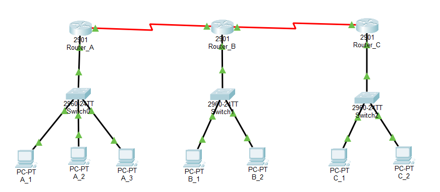
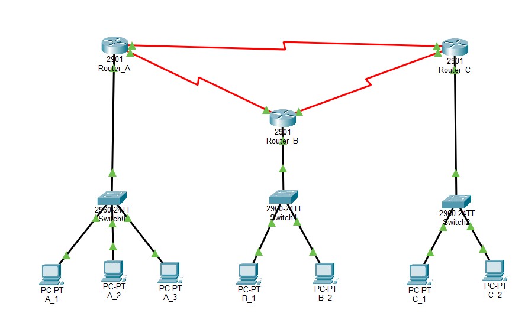
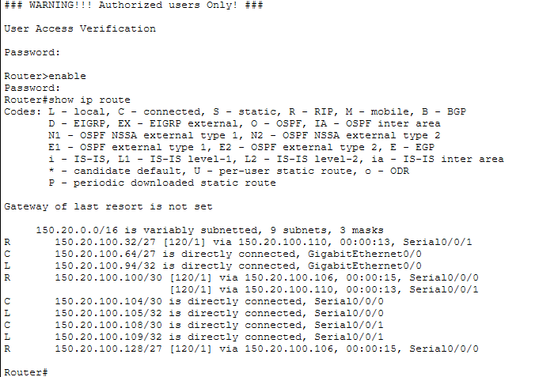
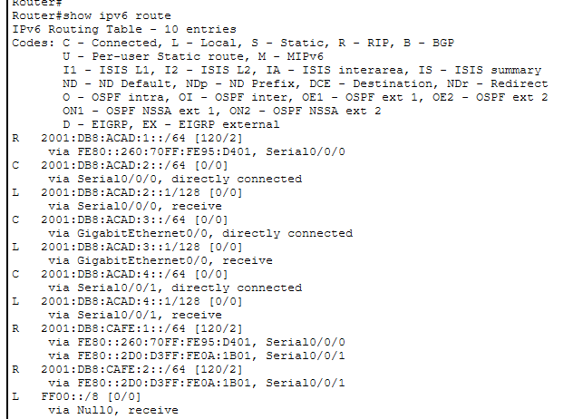
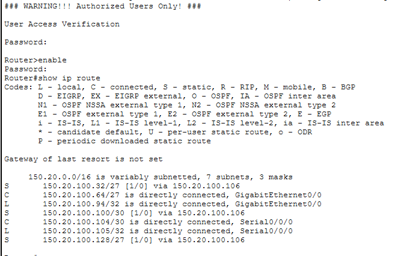
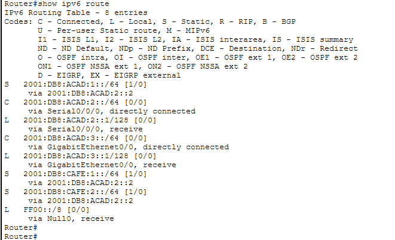
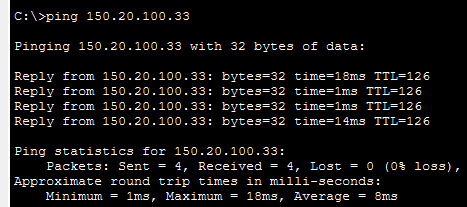
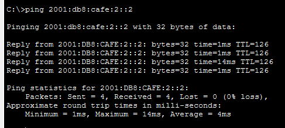

# Lab 01: IPv4 & IPv6 Static and RIP Routing

แบบจำลองระบบเครือข่ายเชื่อมต่อระหว่าง 3 Routers บน Cisco Packet Tracer โดยเปรียบเทียบการกำหนดเส้นทางด้วย **Static Routing** และ **Dynamic Routing (RIPv2 / IPv6 RIP)** รองรับการทำงานแบบ **Dual-Stack (IPv4 & IPv6)** พร้อมประยุกต์ใช้การจัดสรรทรัพยากร IP ด้วย **VLSM** และวางรากฐาน **Device Security Hardening** บนอุปกรณ์เครือข่าย

---

## 1. Network Topologies

### Phase 1: Static Route Topology (Linear WAN)
การเชื่อมต่อแบบจุดต่อจุดผ่าน Router_B เป็นตัวกลาง (A <-> B <-> C)



* **WAN Links:** 2 Serial Links (Router A-B และ B-C)
* **Design:** Traffic ระหว่าง Network A และ C ต้องส่งผ่าน Next-Hop บน Router_B เสมอ

---

### Phase 2: RIP Dynamic Route Topology (Redundant Full-Mesh WAN)
เพิ่ม Redundant Link ระหว่าง Router_A และ Router_C เพื่อสร้างเส้นทางสำรองแบบ Mesh



* **WAN Links:** 3 Serial Links (Router A-B, B-C และเพิ่ม A-C)
* **Design:** ใช้ Dynamic Routing (RIP) เพื่อเลือกเส้นทางที่สั้นที่สุด (Lowest Hop Count) และทำ Failover อัตโนมัติหากมี Link ใดเส้นทางหนึ่งขาด

---

## 2. IP Addressing Table

| Device | Interface | IPv4 Address | Subnet Mask | IPv6 Address | Prefix | Note |
| :--- | :--- | :--- | :--- | :--- | :--- | :--- |
| **Router_A** | Gig0/0 (LAN) | 150.20.100.94 | 255.255.255.224 | 2001:db8:acad:3::1 | /64 | Host Gateway |
| | Ser0/0/0 | 150.20.100.105 | 255.255.255.252 | 2001:db8:acad:2::1 | /64 | Link to Router_B |
| | Ser0/0/1 | 150.20.100.109 | 255.255.255.252 | 2001:db8:acad:4::1 | /64 | **เพิ่มในการทดลองที่ 2 (to C)** |
| **Router_B** | Gig0/0 (LAN) | 150.20.100.158 | 255.255.255.224 | 2001:db8:acad:1::1 | /64 | Host Gateway |
| | Ser0/0/0 | 150.20.100.106 | 255.255.255.252 | 2001:db8:acad:2::2 | /64 | Link to Router_A |
| | Ser0/0/1 | 150.20.100.101 | 255.255.255.252 | 2001:db8:cafe:1::2 | /64 | Link to Router_C |
| **Router_C** | Gig0/0 (LAN) | 150.20.100.62 | 255.255.255.224 | 2001:db8:cafe:2::1 | /64 | Host Gateway |
| | Ser0/0/0 | 150.20.100.102 | 255.255.255.252 | 2001:db8:cafe:1::1 | /64 | Link to Router_B |
| | Ser0/0/1 | 150.20.100.110 | 255.255.255.252 | 2001:db8:acad:4::2 | /64 | **เพิ่มในการทดลองที่ 2 (to A)** |

---

## 3. Key Configuration Snippets

### Basic Device Hardening & Banner
```cisco
enable secret lab8
line console 0
 password lab8
 login
line vty 0 4
 password lab8
 login
banner motd # WARNING!!!! Authorized Users Only! #
```
---
## 3. Configuration Implementations

### A. Static Routing
การกำหนดเส้นทางปลายทางและ Next-Hop แบบระบุเอง (Manual) ทั้ง IPv4 และ IPv6:

```cisco
! ==========================================
! Router_A: Static Route Configuration
! ==========================================
ipv6 unicast-routing

! IPv4 Static Routes (ชี้ไปยังเครือข่ายปลายทางผ่าน Router_B)
ip route 150.20.100.128 255.255.255.224 150.20.100.106
ip route 150.20.100.32  255.255.255.224 150.20.100.106
ip route 150.20.100.100 255.255.255.252 150.20.100.106

! IPv6 Static Routes
ipv6 route 2001:DB8:ACAD:1::/64 2001:DB8:ACAD:2::2
ipv6 route 2001:DB8:CAFE:2::/64 2001:DB8:ACAD:2::2
ipv6 route 2001:DB8:CAFE:1::/64 2001:DB8:ACAD:2::2
```
### B. Dynamic Routing (RIP)
```
! ==========================================
! Router_A: Dynamic RIP Configuration
! ==========================================
ipv6 unicast-routing

! 1. IPv4 RIP (Classless & No Auto-Summary)
router rip
 version 2
 network 150.20.100.0
 no auto-summary

! 2. IPv6 RIP (กำหนดเปิดใช้งานที่ระดับ Interface)
interface GigabitEthernet0/0
 ipv6 rip 10 enable

interface Serial0/3/0
 ipv6 rip 10 enable

interface Serial0/3/1
 ipv6 rip 10 enable
```
---

## 6. Verification & Test Results

### 1 Routing Table Verification
#### RIP
<details>
<summary>ตรวจสอบIPv4 Routing Table บน Router_A หลัง Config เสร็จสมบูรณ์:</summary>
 


</details>
<details>
<summary>ตรวจสอบIPv6 Routing Table บน Router_A หลัง Config เสร็จสมบูรณ์:</summary>
 


</details>

#### Static
<details>
<summary>ตรวจสอบIPv4 Routing Table บน Router_A หลัง Config เสร็จสมบูรณ์:</summary>
 


</details>
<details>
<summary>ตรวจสอบIPv6 Routing Table บน Router_A หลัง Config เสร็จสมบูรณ์:</summary>
 


</details>

### 2 End-to-End Connectivity (Ping Test)
ทดสอบเชื่อมต่อจากเครื่อง Client `A_1` ข้ามไปยัง Network อื่นๆ `C_2`:
* **IPv4 Ping Test:** สำเร็จ


* **IPv6 Ping Test:** สำเร็จ



---

## 🛠 Key Architecture Highlights

### 1. Variable Length Subnet Masking (VLSM)
* **IPv4 Address Optimization:** คำนวณและแบ่ง Subnet ตามความต้องการจริงของแต่ละ Segment เพื่อลดการสูญเสีย IP Address (IPv4 Exhaustion):
  * **LAN Segments (/27 - 255.255.255.224):** จัดสรรขนาด 32 IP (30 Usable Hosts) รองรับผู้ใช้งานฝั่ง Client แต่ละแผนก
  * **WAN Point-to-Point Links (/30 - 255.255.255.252):** จัดสรรขนาด 4 IP (2 Usable Hosts) สำหรับลิงก์เชื่อมต่อระหว่างเราเตอร์แบบจุดต่อจุดโดยเฉพาะ ไม่เหลือทิ้ง IP โดยไม่จำเป็น
* **IPv6 Addressing Plan:** วางระบบ Dual-Stack โดยจัดสรร Prefix ขนาดมาตรฐาน `/64` สำหรับทุกๆ Segment ทั้งฝั่ง LAN และ WAN Link เพื่อรองรับการขยายตัวและ SLAAC ในอนาคต

---

### 2. Network Security & Management Hardening
* **Administrative Access Protection:** ป้องกันการเข้าถึง Privilege EXEC Mode และ Console Port ด้วยการกำหนดรหัสผ่านและสิทธิ์การเข้าถึง (`enable secret` / `login authentication`)
* **Remote Management Control:** กำหนดความปลอดภัยบน VTY Lines สำหรับการรีโมตเข้ามาจัดการอุปกรณ์
* **Legal Banner Protection:** ติดตั้งคำเตือนทางกฎหมาย (`banner motd`) เพื่อแจ้งเตือนสถานะ Authorized Access Only และมีผลในการบังคับใช้ตามนโยบายความมั่นคงปลอดภัยสารสนเทศ
* **Routing Control:** ป้องกัน Routing Loop และการรั่วไหลของตารางเส้นทางด้วยการกำหนด Classless Routing (`version 2`) พร้อมปิดการสรุปเส้นทางอัตโนมัติ (`no auto-summary`)

---

## 📁 Lab Simulation Files

ดาวน์โหลดไฟล์จำลองเพื่อเปิดทดสอบด้วย Cisco Packet Tracer:

* **Static Routing Topology:** [`static.pkt`](./topologies/static.pkt)
* **Dynamic RIP Routing Topology:** [`rip.pkt`](./topologies/rip.pkt)

> **หมายเหตุ:** แนะนำให้เปิดด้วย Cisco Packet Tracer เวอร์ชัน 9.0.x ขึ้นไป
