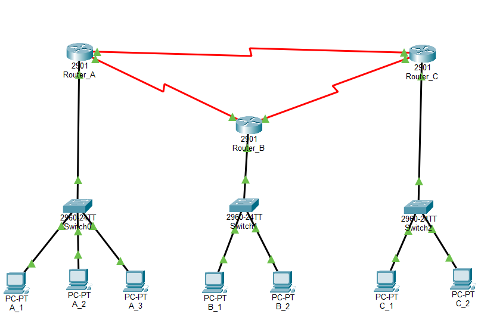

# Lab 01: IPv4 & IPv6 Static and RIP Routing

แบบจำลองระบบเครือข่ายเชื่อมต่อระหว่าง 3 Routers โดยเปรียบเทียบการกำหนดเส้นทางด้วย **Static Routing** และ **Dynamic Routing (RIPv2 / RIPng)** รองรับทั้ง IPv4 และ IPv6 (Dual-Stack) บน Cisco Packet Tracer

---

## 1. Network Topology


* **Routers:** 3x Cisco 2901 (Router_A, Router_B, Router_C)
* **Switches:** 3x Cisco 2960
* **WAN Links:** Serial Connection ระหว่าง Router A-B, B-C และ A-C (Mesh)

---

## 2. IP Addressing Table

| Device | Interface | IPv4 Address | Subnet Mask | IPv6 Address | Prefix |
| :--- | :--- | :--- | :--- | :--- | :--- |
| **Router_A** | Gig0/0 (LAN) | 150.20.100.94 | 255.255.255.224 | 2001:db8:acad:3::1 | /64 |
| | Ser0/3/0 (to B) | 150.20.100.105 | 255.255.255.252 | 2001:db8:acad:2::1 | /64 |
| | Ser0/3/1 (to C) | 150.20.100.109 | 255.255.255.252 | 2001:db8:acad:4::1 | /64 |
| **Router_B** | Gig0/0 (LAN) | 150.20.100.158 | 255.255.255.224 | 2001:db8:acad:1::1 | /64 |
| | Ser0/3/0 (to A) | 150.20.100.106 | 255.255.255.252 | 2001:db8:acad:2::2 | /64 |
| | Ser0/3/1 (to C) | 150.20.100.101 | 255.255.255.252 | 2001:db8:cafe:1::2 | /64 |
| **Router_C** | Gig0/0 (LAN) | 150.20.100.62 | 255.255.255.224 | 2001:db8:cafe:2::1 | /64 |
| | Ser0/3/0 (to B) | 150.20.100.102 | 255.255.255.252 | 2001:db8:cafe:1::1 | /64 |
| | Ser0/3/1 (to A) | 150.20.100.110 | 255.255.255.252 | 2001:db8:acad:4::2 | /64 |

---

## 3. Key Configuration Snippets

### Basic Device Hardening & Banner
```cisco
enable secret lab8
line console 0
 password lab8
 login
line vty 0 4
 password lab8
 login
banner motd # WARNING!!!! Authorized Users Only! #
```
---
## 4.Static Routing (IPv4 & IPv6)
### Cisco CLI
```
! Enable IPv6 Routing
ipv6 unicast-routing

! IPv4 Static Route
ip route 150.20.100.128 255.255.255.224 150.20.100.106

! IPv6 Static Route
ipv6 route 2001:DB8:ACAD:1::/64 2001:DB8:ACAD:2::2
```
---
## 5.Dynamic Routing (RIPv2)
### Cisco CLI
```
! RIPv2 for IPv4
router rip
 version 2
 network 150.20.100.0
 no auto-summary
! IPv6 RIP (Process-ID: 10)
interface GigabitEthernet0/0
 ipv6 rip 10 enable

interface Serial0/3/0
 ipv6 rip 10 enable
```
---

## 6. Verification & Test Results

### 1. Routing Table Verification
ตรวจสอบIPv4 Routing Table บน Router_A หลัง Config เสร็จสมบูรณ์:

ตรวจสอบIPv6 Routing Table บน Router_A หลัง Config เสร็จสมบูรณ์:


### 2. End-to-End Connectivity (Ping Test)
ทดสอบเชื่อมต่อจากเครื่อง Client `A_1` ข้ามไปยัง Network อื่นๆ:
* **IPv4 Ping Test:** สำเร็จ

* **IPv6 Ping Test:** สำเร็จ


---

## 7. Key Takeaways & Skills Gained
* **Dual-Stack Network Architecture:** ออกแบบและจัดสรร Address ทั้ง IPv4 Subnetting (/27, /30) และ IPv6 Prefix (/64) ในระบบเดียวกัน
* **Static vs Dynamic Routing Trade-offs:** เข้าใจความแตกต่างระหว่างการใช้ Static Route ที่ประหยัด Resource แต่ดูแลยากในระดับ Enterprise เทียบกับ Dynamic Routing (RIP) ที่อัปเดตอัตโนมัติ
* **Network Device Hardening:** ตั้งค่ารหัสผ่านความปลอดภัยพื้นฐานบน Console และ Telnet (VTY Lines) รวมถึงการตั้ง Warning Banner ตามมาตรฐานความปลอดภัย
